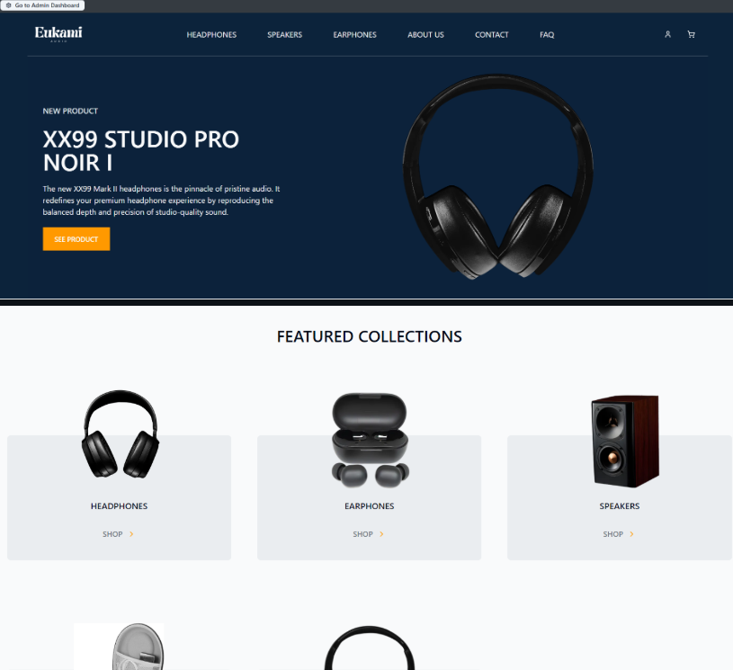
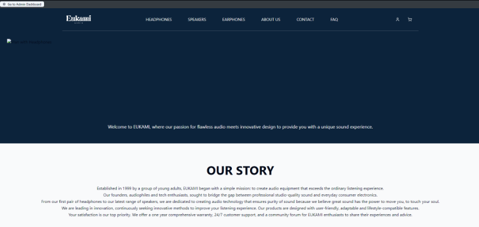
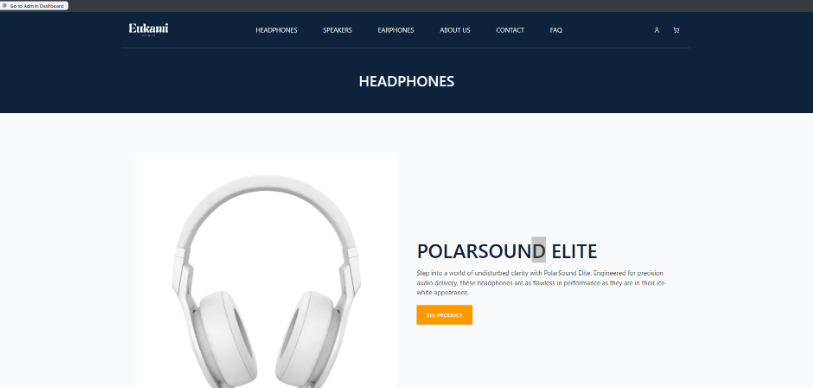
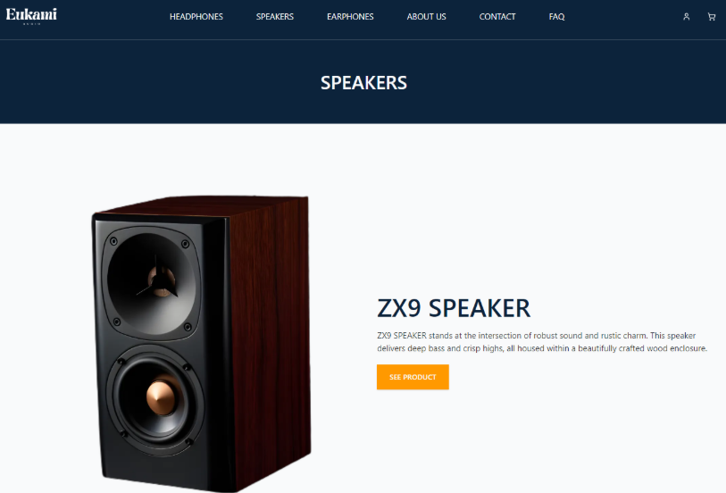
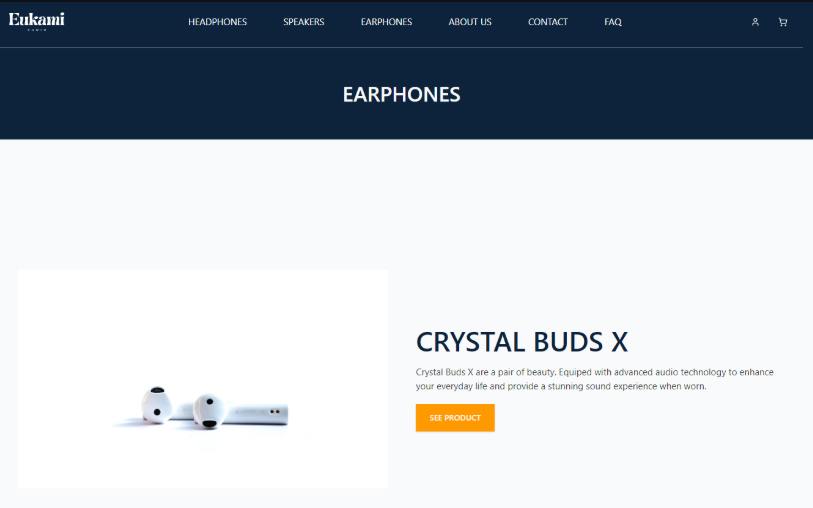
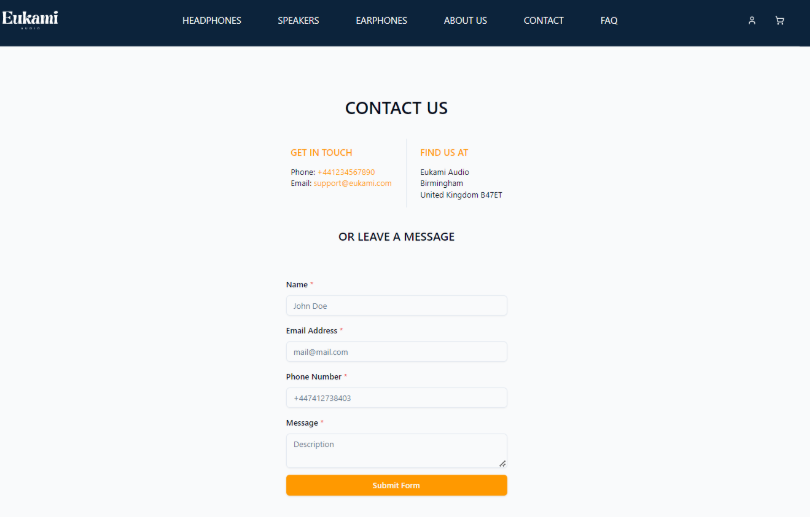
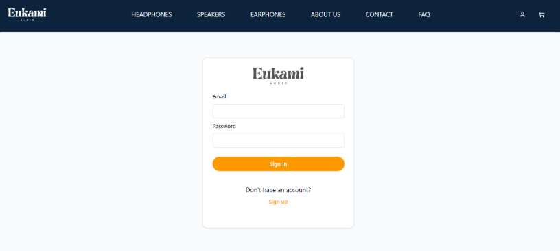
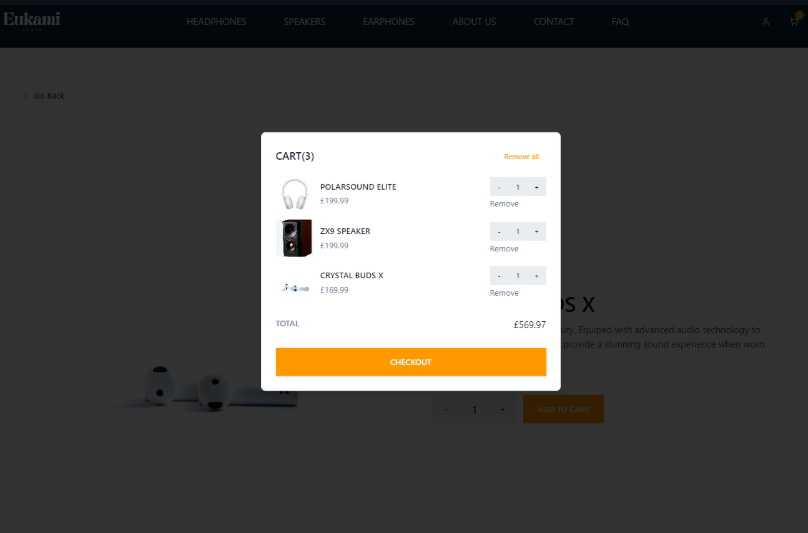

# EUKAMI – E-commerce Website for Audio & Electronic Products

## Introduction

This project was developed as part of the Team Project module in the MSc Computer Science program. The aim was to collaborate in a small agile team to design and implement a full-stack e-commerce website for audio and electronic products, based on real client requirements.

The project followed the full Software Development Lifecycle (SDLC):
- ✅ **Requirements Gathering** – Conducted through client interviews.
- 📝 **Planning & Analysis** – Defined user stories, use cases, and technical architecture.
- 🎨 **Design** – Wireframes and UI/UX planning using Figma.
- ⚙️ **Development** – Carried out in agile sprints with version control via Git/GitHub.
- 🧪 **Testing** – Included unit, integration, and user acceptance testing.
- 🚀 **Deployment** – Final product deployed using Vercel and demonstrated to the client with feedback loops for improvements.

## The Team

This project was completed by a multidisciplinary team using Agile methodologies. Tasks were distributed based on individual strengths and areas of expertise.

| Name                     | Role(s)                                 | GitHub            |
|--------------------------|------------------------------------------|-------------------|
| Kenny Kei Yun Sum        | Front-end Development, Documentation     | [Kenji1245]
| Muhtasib-Billah Dahir    | Front-end & Back-end Development         | [Muhtasib1]
| Usman Ali Iqbal          | Full-stack Development, UI/UX, Testing   | [Usman-A-Iqbal]
| Avinash Kommalapati      | UI Design, Testing                       | [Avinashkom]
| Ifeoluwa Odubela         | Full-stack Development, Project Leader   | [Ife-Ody]
| Eniola Oduekun           | Front-end Development                    | [enzoriise]
| Khadija Amin             | UI Design, Documentation                 | [Aminkhadi]

## Aim of the project 

The goal of this project was to design and implement a fully functional e-commerce website focused on the sale of audio and electronic products. The platform offers a range of items including headphones, earphones, speakers, and accessories, aiming to provide users with a seamless, secure, and modern shopping experience.


## Target Audience
The primary audience for EUKAMI includes music enthusiasts aged between 14 and 30. The website focuses on delivering high-quality audio products with a clean, intuitive interface tailored for young consumers.

## Tools & Technologies Used

- **HTML** – Structured the content of the web pages.  
- **Tailwind CSS** – Applied utility-first styling for responsive design.  
- **React** – Built dynamic and reusable user interface components.  
- **Node.js** – Enabled server-side functionality and backend logic.  
- **Supabase** – Hosted the PostgreSQL database used to manage product and user data.  
- **Trello** – Managed project planning and sprint task tracking.  
- **WhatsApp** – Used for daily communication and updates among team members.  
- **Google Meet** – Conducted weekly meetings with screen sharing and task discussions.  
- **Figma** – Designed wireframes and visual prototypes for UI/UX.  
- **Git & GitHub** – Managed version control and team collaboration on the codebase.  
- **Vercel** – Hosted and deployed the front-end application.


## What We Learned

- 🌱 Developed strong team collaboration and communication skills through regular meetings and Agile practices.
- 🔍 Learned to identify and resolve issues quickly during the development process.
- 📚 Gained hands-on experience with tools such as React, Tailwind CSS, Supabase, Git/GitHub, and Vercel.
- 🧠 Improved knowledge of SDLC phases including requirements analysis, prototyping, testing, and deployment.

## Getting Started

To get started with this project, clone the repository and install the dependencies:

```bash
git clone git@github.com:Usman-A-Iqbal/Eukami-public.git
cd Eukami-public
npm install
npm run dev //to run this on your local machine
```
> Note you will also need to create the environment variables in env.local
>

 ## Main Page

The landing page showcases featured products and categories in a modern, professional, and intuitive layout. It highlights trending items and allows users to navigate easily to product categories.




## About Us

Provides background on how EUKAMI was founded and its mission.



## Headphones

The Headphone page contains various high quailty headphones for purchase. 



## Speakers

The Speaker page provides numerous top-grade Speakers available to buy.



## Earphones 

The earphone page gives a diverse number of exceptional Earphones customers can obtain. 



## Contact Us 

The Contact Us page allows customer to contact support if they experience any problems with the product, website, delivery or other inquiries.



## Sign in or Sign up

This page allows customers to sign in or create an account if they haven't already. 



## Cart page 

This page allows customers to finalise products purchase once they decided which product to buy. 




